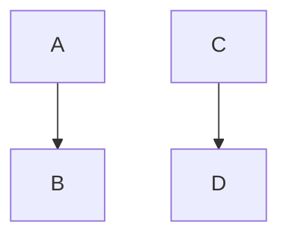

### レベル
※ 棒グラフ追加予定(設計中)

## 全体技術ステータス
※ こっちはchart raderを利用して作る予定

<canvas id="programmer-ability" height="200"></canvas>

## 設計

## 言語
- Java
- Ruby
- Python
- Visual Basic

## フレームワーク
- Spring boot
- Ruby on Rails

## フロントエンド
- Javascript
- JQuery
- CSS

## 開発ツール
- Eclipse
- XCode
- Visual Studio

## データベース
- MYSQL
- PostgreSQL
- Oracle

## DevOps
- gitLab

## アルゴリズム

## その他
- Github
- Redmine
- AWS関連
- 人工知能
- 数学

<canvas id="canvas2" height="300"></canvas>

